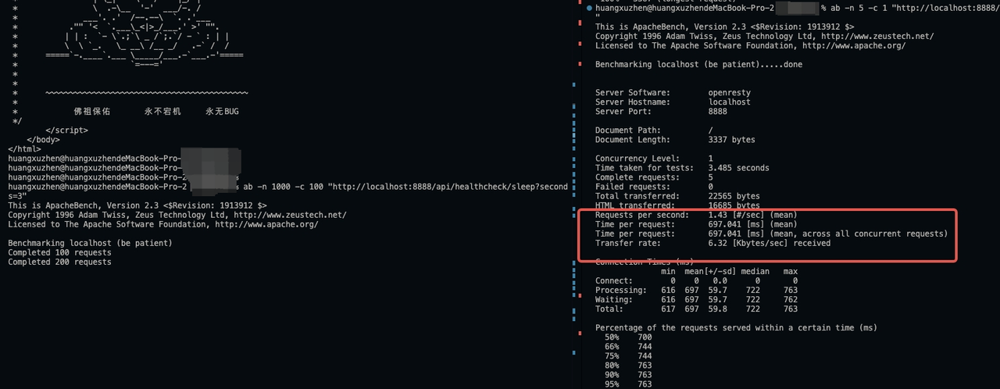

# Hyperf Insert 性能问题

### Prerequisites

总数据量: 55857单次写入: 5000Example: (70000,2023-11-16 09:38:05,2023-11-16 09:38:05,,2023-10-24,170000000,5000,18.13,75.25,XX-547,-,baidu.com,1111111111111,bbbbbb, 哈哈哈)

### Javascript(knex,mysql2): 865.664ms

```javascript
const data = require('./orders.json')
const knex = require('knex')({
  client: 'mysql2',
  connection: {
    host : '127.0.0.1',
    port : 3306,
    user : 'root',
    password : 'root',
    database : 'demo'
  }
});

console.time('insert')
// knex('orders').limit(1).then(console.log)
knex.batchInsert('orders',data, 5000).then(res=>{
  console.timeEnd('insert')
  console.log(res)
})
/** output:
insert: 865.664ms
[
  1463855, 1468855,
  1473855, 1478855,
  1483855, 1488855,
  1493855, 1498855,
  1503855, 1508855,
  1513855, 1518855
]
**/
```

### Laravel DB: 1.78s, Emulate: 1.00s

```php
$start = microtime(true);
$data = json_decode(file_get_contents('orders.json'), true);
collect($data)->chunk(5000)->each(fn($chunk) => DB::table('orders')->insert($chunk->toArray()));
$this->info('Cost: '.microtime(true)-$start);
// Cost: 1.7831189632416
// 'options' => [
//   PDO::ATTR_EMULATE_PREPARES => true
// ]
// Cost: 1.0062611103058
```

### Hyperf Db: 21.3s, Emulate: 21.18s

```php
$data = json_decode(file_get_contents('orders.json'), true);
$start = microtime(true);
collect($data)->chunk(5000)->each(fn($chunk) => Db::table('orders')->insert($chunk->toArray()));
$this->info('Cost: '.microtime(true)-$start);
// Cost: 21.334911108017
// 'options' => [
//   PDO::ATTR_EMULATE_PREPARES => true
// ]
// Cost: 21.18748998642
```

Profiling with XHPROF

#### Disable DbQueryExecutedListener: 10.24s

<figure><figcaption></figcaption></figure>

```php
<?php

#[Listener]
class DbQueryExecutedListener implements ListenerInterface
{
    public function listen(): array
    {
        return [
//            QueryExecuted::class,
        ];
    }
}
```

#### Builder Statement: 809.170ms

`Arr::flatten` poor performance

<figure><figcaption></figcaption></figure>

```php
$data = json_decode(file_get_contents('orders.json'), true);
$start = microtime(true);
$chunkSize = 5000;
// example: [["INSERT INTO orders (created_at,id) VALUES (?,?)", ["2023-01-01",1]]]
$statements = [];
$keys = array_keys($data[0]);
$keysCount = count($keys);
$keysString = implode(',', $keys);
collect($data)->chunk($chunkSize)->each(function (Collection $chunk) use (&$statements, $keys, $keysCount, $keysString) {
    $marks = [];
    for ($i = 0; $i < $chunk->count(); $i++) {
        $itemMarks = [];
        for ($j = 0; $j < $keysCount; $j++) {
            $itemMarks[] = '?';
        }
        $marks[] = '(' . implode(',', $itemMarks) . ')';
    }
    $marks = implode(',', $marks);
    $statements[] = [
        "INSERT INTO orders ($keysString) VALUES $marks",
        $chunk->flatten()->toArray() // <--- 这里如果替换成array_merge(...$chunk->toArray()) 只需要0.04s
    ];
});
$this->info('PHP Cost: ' . microtime(true) - $start);
$start = microtime(true);
foreach ($statements as $statement) {
    Db::insert(...$statement);
}
$this->info('DB Cost: ' . microtime(true) - $start);
return;
```

<figure><figcaption></figcaption></figure>

#### Fucking why?

Hyperf 的 Arr::flatten存在性能问题，见pr：



```php
// Laravel: https://github.com/laravel/framework/blob/10.x/src/Illuminate/Collections/Arr.php
public static function flatten($array, $depth = INF)
{
    $result = [];

    foreach ($array as $item) {
        $item = $item instanceof Collection ? $item->all() : $item;

        if (! is_array($item)) {
            $result[] = $item;
        } else {
            $values = $depth === 1
                ? array_values($item)
                : static::flatten($item, $depth - 1);

            foreach ($values as $value) {
                $result[] = $value;
            }
        }
    }

    return $result;
}
// Hyperf
public static function flatten(array $array, int|float $depth = INF): array
{
    $result = [];
    foreach ($array as $item) {
        $item = $item instanceof Collection ? $item->all() : $item;
        if (! is_array($item)) {
            $result[] = $item;
        } elseif ($depth === 1) {
            $result = array_merge($result, array_values($item));
        } else {
            $result = array_merge($result, static::flatten($item, $depth - 1));
        }
    }
    return $result;
}
```

#### Benchmark

```php
public function handle()
{
    $source = [];
    $exampleItem = ['a','b','c','d','e','f','g','h']; // 8
    for ($i=0; $i<5000; $i++){
        $source[] = $exampleItem;
    }
    $start = microtime(true);
    \Hyperf\Collection\collect($source)->flatten();
    var_dump('cost: ' . microtime(true) - $start); // original: 0.21s, now: 0.001s
}
```

\
